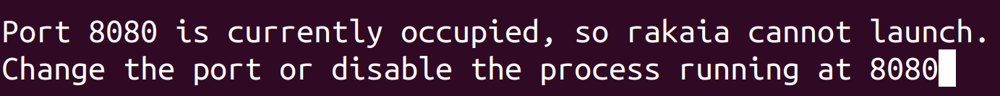

## For Users

This repository contains `rakaia` standalone builds for Windows, Linux, and macOS (built separately for Intel vs. Silicon architectures, see below). You should download the zip bundle corresponding to your OS and architecture.
Once the zip bundle is downloaded and unzipped, there should be both an executable file named `rakaia_{os}_{arch}_{version}` in the unzipped destination, as well as an `_internal` directory of package dependencies if compiled for either macOS or Windows.

\
\
**IMPORTANT**: on macOS and Windows, both the executable
and the `_internal` directory should remain in the same directory when the files are
unzipped to their destination, or if the files are moved.

Depending on your OS, the execution steps will vary slightly:

## Windows

On Windows, the executable can simply be opened by double-clicking the application icon. In some cases, it may require admin permissions.
For this, right-click the executable file and select `Run as administrator`

## macOS

**NOTE**: macOS builds for  `rakaia` are made separately for Silicon (M-chip) and Intel architectures.
Builds for Intel-compatible architecture will have **x86_64** in the name,
whereas a build compatible with M chips for Silicon will have **arch** in the name.
Users should be sure to select the build zip for the appropriate chip architecture, or there will be compilation platform errors on opening.
\

On macOS, the executable file can be double-clicked to open.
\

**NOTE**: On macOS, it is possible that the `rakaia` executable will be
flagged due to security reasons. If the application fails to start, users
should check the security settings to see if `rakaia` is flagged from an unknown developer:
https://support.apple.com/en-gb/guide/mac-help/mh40616/mac.
If so, users should enable the software to be installed, then try opening the file again.

## Linux

On Linux, the executable file can be double-clicked or run through the command line:

```
./rakaia_linux-x86_64_{version}
```

**NOTE**: Double clicking the application on Linux will run it in the background without a terminal,
and the port usage (default 8080) will need to be killed with `fuser` or `kill`.
Therefore, it is recommended to execute on Linux through the command line.

## Port Usage

The default port for `rakaia` executable files is 8080 on every OS. Users should ensure that no current process or application is running on this port, or they will see the following console error on file execution:

```{r, echo=FALSE, out.width = '80%', fig.align="center"}

```


## Troubleshooting

For general installation and run support, please contact mwatson@lunenfeld.ca

## Source code access

For users who prefer source code access and installation from source, `rakaia` is
available at: https://github.com/camlab-bioml/rakaia under the same licensing as the standalone bundles.


### Windows SDK dependencies

Although unlikely, in certain cases, Windows user may need to install the [Windows Development SDK](https://developer.microsoft.com/en-us/windows/downloads/windows-sdk/) to have all required dll libraries for `rakaia` on Windows.
