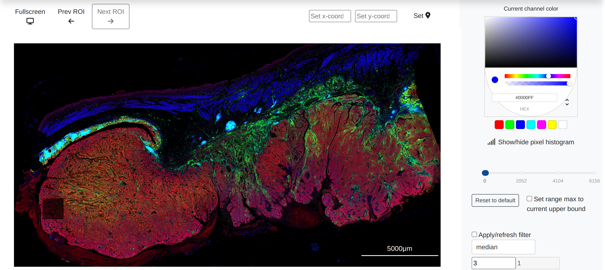

# ccramic

ccramic: **C**ell-type **C**lassification (using) 
**R**apid **A**nalysis (of) **M**ultiplexed **I**maging 
(mass) **C**ytometry in the browser

<p align="center">
    
</p>


ccramic provides streamlined in-browser interactive analysis of multiplexed imaging datasets.
The ccramic viewer is capable of rapid analysis of large regions of interest (ROI)
from imaging technologies such as imaging mass cytometry (IMC), 
Immunofluorescence (IF) and others. The analysis suite includes
pixel level analysis, object/segmentation detection, region annotation,
object quantification, among other tools. 


## Installation

ccramic can be cloned and installed locally using access to the Github repository

```
git clone https://github.com/camlab-bioml/ccramic.git && cd ccramic
```

From there, the user may either install with or without a conda environment:

### Without conda (not recommended)

ccramic can be installed locally without an environment or container,
but this is not recommended for dependency management:

```
pip install -r requirements.txt
pip install .
```

### With conda

conda is the recommended installation manager for ccramic. To install conda locally,
visit [this link](https://conda.io/projects/conda/en/latest/user-guide/install/index.html) and
select the relevant operating system.

Once conda is installed:

```
conda create --name ccramic python=3.9
conda activate ccramic
# cd ccramic
pip install -r requirements.txt
pip install .
```

### with Make

ccramic contains a Makefile that wraps the pip installation
commands above. Installation can be done as follows:

```
# cd ccramic
make
make install
```

## Updating local installations

From source, ccramic can be updated locally using the following commands:

```
# navigate to the directory where you cloned ccramic from github
cd ccramic
git switch main
git pull --all
pip install .
```

## Running ccramic

After installation, ccramic can be run through conda or simply executed using the `ccramic` command:

```
conda activate ccramic
ccramic
```

The ClI options for running ccramic can be viewed using:

```
ccramic -h
```

The user should then navigate to `http://127.0.0.1:5000/` or `http://0.0.0.0:5000/` to access ccramic.

The current version of ccramic can also be checked on the command line with the following (v0.4.0 or later):

```
ccramic -v
```

### Command line configurations

Command line options for running custom ccramic sessions can be
found in the documentation: https://camlab-bioml.github.io/ccramic-doc/docs/cli


## Documentation

The official user guide documentation for ccramic can be 
found here: camlab-bioml.github.io/ccramic-doc/

## mongoDB

From ccramic v0.12.0, users can use a registered mongoDB account for the
`ccramic-db` mongoDB instance to import, save, and remove past saved configurations.
Login information for the shared lab account is as follows:

```commandline
username: jacksonlab
password: ccramic-user
```

## For developers

ccramic can be run in editable mode with either configuration shown below,
which permits source code changes to be applied to the application on the fly:

```
pip install -e .
ccramic
```

Installing an editable version through pip is also required to run unit tests:

```
pytest --headless --cov ccramic
```

Conversely, without app installation:

```
python ccramic/wsgi.py
```

ccramic can also support being run in debug mode, which will apply source code changes to active sessions while the
application is running (NOte that changes to the source code will trigger an application page refresh). This can be
enabled using the `-d` CLI option:

```commandline
ccramic -d
```

## Troubleshooting

Troubleshooting tips can be found in the `Troubleshooting`
section of the documentation: https://camlab-bioml.github.io/ccramic-doc/docs/troubleshooting
