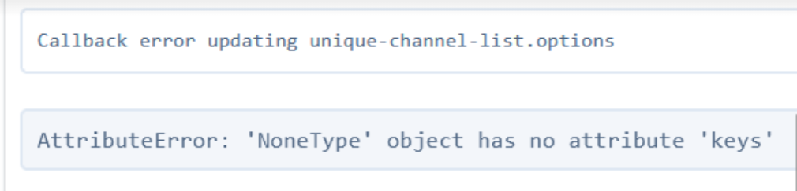

# ccramic

Cell-type Classification (using) Rapid Analysis (of) Multiplexed Imaging (mass) Cytometry using Flask and Dash.

ccramic provides in-browser interactive analysis of multiplexed imaging datasets.

## Installation

ccramic can be cloned and installed locally using access to the Github repository

```
git clone https://github.com/camlab-bioml/ccramic.git && cd ccramic
```

From there, the user may either install with or without a conda environment:

### Without conda (not recommended)

ccramic can be installed locally without an environment or container,
but this is not recommended for dependency management:

```
pip install -r requirements.txt
pip install .
```

### With conda

conda is the recommended installation manager for ccramic. To install conda locally,
visit [this link](https://conda.io/projects/conda/en/latest/user-guide/install/index.html) and
select the relevant operating system.

Once conda is installed:

```
conda create --name ccramic python=3.9
conda activate ccramic
# cd ccramic
pip install -r requirements.txt
pip install .
```

### with Make

ccramic contains a Makefile that wraps the pip installation
commands above. Installation can be done as follows:

```
# cd ccramic
make
make install
```

## Updating local installations

From source, ccramic can be updated locally using the following commands:

```
# navigate to the directory where you cloned ccramic from github
cd ccramic
git switch main
git pull --all
pip install .
```

## Running ccramic

After installation, ccramic can be run through conda or simply executed using the `ccramic` command:

```
conda activate ccramic
ccramic
```

The ClI options for running ccramic can be viewed using:

```
ccramic -h
```

The user should then navigate to `http://127.0.0.1:5000/` or `http://0.0.0.0:5000/` to access ccramic.

The current version of ccramic can also be checked on the command line with the following (v0.4.0 or later):

```
ccramic -v
```

### Custom Ports (v0.8.0 or later)

As of ccramic v0.8.0, the user is able to specify a different port (default remains 5000).
Suggested alternative ports are 8050 and 8080. The port can be specified in the CLI with:

```commandline
ccramic -p 8050
```

The local URL will then take the form of `http://127.0.0.1:{port}` such as
`http://127.0.0.1:8050/

### Local file dialog (v0.7.0 or later)

With ccramic v0.7.0 or later, the user has the option to use a
local file dialog rendered with wxPython on local runs. This can be instantiated with
the `-l` CLI option when running ccramic (by default, this feature
is not included):

```commandline
ccramic -l
```

**IMPORTANT**: Due to the limitations of wxPython on multi-threaded
systems as well as compatibility problems on different OS options, this feature
is not likely to work properly on macOS.

In order to use this feature, users should make sure to install
wxPython [from the proper download page](https://wxpython.org/pages/downloads/index.html)

### Other options

By default, ccramic will run in threaded mode. To disable using a multi-threaded application instance, add `-dt` as
a command line option:

```commandline
ccramic -dt
```

ccramic also uses Dash-based load screens to indicate that data
are being imported or changed (i.e. on an ROI change). To disable
the load screens for data manipulation, use the `-dl` CLI option:

```commandline
ccramic -dl
```

ccramic supports custom default colour swatches that are input by
the user. An example using 14 custom colours:

```commandline
ccramic -sc "#25262b,#868e96,#fa5252,#e64980,#be4bdb,#7950f2,#4c6ef5,#228be6,#15aabf,#12b886,#40c057,#82c91e,#fab005,#fd7e14"
```

## Basic authentication

ccramic uses basic authentication upon a new session. The credentials are as follows:

* username: ccramic_user
* password: ccramic-1

**Note** that the basic authentication credentials are likely to change as development builds update.

## Docker

ccramic can be run using Docker with the following commands (requires an installation of Docker):


```
cd ccramic
docker build -t ccramic .
# use -d to run detached in the background
docker run -d -p 5000:5000 ccramic:latest ccramic
```

Local file destinations can be mounted for direct access to local filepaths
in the containerized environment, such as :

```
docker run -p 5000:5000 -v /home/:/home/ ccramic:latest ccramic
```

Navigate to the local address `http://0.0.0.0:5000/` or `http://127.0.0.1:5000/`

## mongoDB

From ccramic v0.12.0, users can use a registered mongoDB account for the
`ccramic-db` mongoDB instance to import, save, and remove past saved configurations.
Login information for the shared lab account is as follows:

```commandline
username: jacksonlab
password: ccramic-user
```

## Documentation

The official documentation and user manual for ccramic is in progress. For some FAQ,
visit [the FAQ documentation](man/README.md)

## For developers

ccramic can be run in editable mode with either configuration shown below,
which permits source code changes to be applied to the application on the fly:

```
pip install -e .
ccramic
```

Installing an editable version through pip is also required to run unit tests:

```
pytest --headless --cov ccramic
```

Conversely, without app installation:

```
python ccramic/wsgi.py
```

ccramic can also support being run in debug mode, which will apply source code changes to active sessions while the
application is running (NOte that changes to the source code will trigger an application page refresh). This can be
enabled using the `-d` CLI option:

```commandline
ccramic -d
```

## Troubleshooting

### Callback error in updating `unique-channel-list.options`

<p align="center">
    
</p>

An error of this type is likely to occur during data import, and may be
the result of low temporary storage available on the hard drive.
Users should review the data management and storage settings for
their specific OS to diagnose if there is sufficient storage space
for the ccramic session caching. In general, the user should aim
for at least 2x the total dataset size of temporary storage (So for
analysis of a 10GB dataset, at least 20GB of temp disk space should
be kept free.)

## Performance

### Array casting

By default, ccramic will store imported data as 32 byte float arrays.
Information on numpy dtypes can be found [here](https://numpy.org/doc/stable/reference/arrays.dtypes.html).
To reduce memory consumption and the amount of temporary disk storage required, users can choose
to have arrays stored as 16 byte unsigned integers instead by invoking the
CLI option `--array-type` (from v0.11.0 onwards):

```commandline
ccramic -at int
```

In many instances, using integer array types will save up to 50%
of the disk space required for storing the same array in float32 format.

This option will work well for the majority of user cases, as arrays
are always converted into integers when recoloured and blended in the canvas. **However**,
there are two specific use cases where storing the arrays as float are beneficial or necessary:

- When the channel array has values between 0 and 1: these values will automatically be converted
to 0 or 1 with integer casting, so any decimal precision will be lost for this channel.
- When the array channel has a maximum value over 65535: Unsigned 16 byte integers
in numpy have a maximum positive range of 65535, so any array values that are greater
will be clipped to this value

For the use cases above, users are advised to use the default array storage type.
