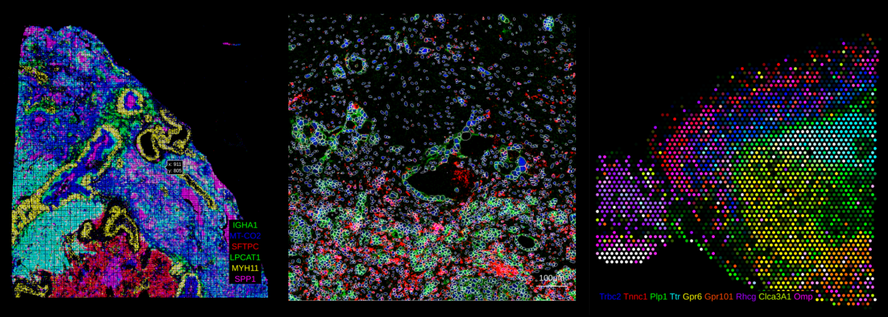

# rakaia

rakaia: Scalable spatial biology analysis in the browser

<p align="center">
    
</p>


rakaia provides streamlined in-browser analysis of multiplexed spatial proteomics and transcriptomics.
The rakaia viewer is capable of rapid, interactive analysis of large regions of interest (ROI), and
currently supports the following technologies:

- Multiplexed imaging such as imaging mass cytometry (IMC), immunofluorescence (IF), and immunohistochemistry (IHC)
- Spatial transcriptomics (ST) such as 10X Visium (V1, V2, HD), Xenium, and others
- Whole slide images (WSI) such as H&E

Tools in the rakaia application include:

- pixel level analysis for publication-quality blended images
- object/segmentation detection & overlay
- region/focal annotation
- object quantification
- cluster and heatmap visualization
- dataset-wide profiling and multi-ROI search
- database support (mongoDB)
- WSI coordinate alignment (currently for 10X Visium & Xenium)

Visit the [official documentation](https://camlab-bioml.github.io/rakaia-doc/) to learn more!

rakaia benefits from on-demand data loading and requires minimal upfront data
configuration for ease-of-use image analysis. It places no restrictions on
data or project size, permitting users to visualize and analyze hundreds of
regions or images in a single session.

Importantly, rakaia does not require any coding/scripting, or
any pre-defined project directories with specific file structures.

rakaia is built on:

- Flask
- Dash Bootstrap w/ React
- Docker
- MongoDB
- openseadragon
- vips

## Installation

**NOTE: As of rakaia 0.24.0, the required Python version(s) are 3.10+ (3.10 or 3.11 recommended).**

rakaia can be cloned and installed locally using access to the GitHub repository

```
git clone https://github.com/camlab-bioml/rakaia.git && cd rakaia
```

From there, the user may either install with or without a conda environment:

### Without conda (not recommended)

rakaia can be installed locally without an environment or container,
but this is not recommended for dependency management:

```
cd rakaia
pip install .
```

### With conda

conda is the recommended installation manager for rakaia. To install conda locally,
visit [this link](https://conda.io/projects/conda/en/latest/user-guide/install/index.html) and
select the relevant operating system.

Once conda is installed:

```
conda create --name rakaia python=3.11
conda activate rakaia
cd rakaia
pip install .
```

### vips for WSI rendering (optional)

To view WSIs such as H&E, an installation of [libvips](https://www.libvips.org/) is required,
and is not installed through the pip installation above.

Users should visit the [vips installation page](https://www.libvips.org/install.html) for
instructions on installing for a specific OS.

**Note**: macOS users should install `vips` using `brew` as opposed to conda.

### Installation troubleshooting

#### ParmED

If installation of the [ParmEd](https://github.com/ParmEd/ParmEd) library fails (appears to be
more prevalent on older versions of macOS), then users should try installing it from conda source:

```commandline
pip uninstall parmed
conda install -c conda-forge parmed=4.3.0
```

#### leidenalg

If installation of the [leidenalg](https://github.com/vtraag/leidenalg) library fails (
appears to happen on MacOS with Python 3.12+), then users should try installing it from conda source:

```commandline
pip uninstall leidenalg
conda install -c conda-forge leidenalg=0.10.2
```

### with Make

rakaia contains a Makefile that wraps the pip installation
commands above. Installation can be done as follows:

```
# cd rakaia
make
make install
```

## Updating local installations

From source, rakaia can be updated locally using the following commands:

```
# navigate to the directory where you cloned rakaia from github
cd rakaia
# activate your env first, if using conda
# conda activate rakaia
git switch main
git pull --all
pip install .
```

## Running rakaia

After installation, rakaia can be run through conda or simply executed using the `rakaia` command:

```
conda activate rakaia
rakaia
```
The user should then navigate to `http://127.0.0.1:8080/` or `http://0.0.0.0:8080/` to access rakaia.

## Docker

rakaia is available to run through a Docker container:

```commandline
docker build -t rakaia .
```

By default, the ports `8080` and `5000` are suggested for use. If
the user uses `5000`, the port will need to be specified in the run command:

```commandline
docker run -p 8080:8080 -v /home/:/home/ rakaia:latest rakaia -da
# or run with the alternative port
docker run -p 5000:5000 -v /home/:/home/ rakaia:latest rakaia -da -p 5000

```

### Help

The ClI options for running rakaia can be viewed using:

```
rakaia -h
```

Additional information on the CLI options available for running custom rakaia sessions can be
found in the documentation: https://camlab-bioml.github.io/rakaia-doc/docs/cli


The current version of rakaia can also be checked on the command line:

```
rakaia -v
```

## Documentation

The official user guide documentation for rakaia can be
found [here](https://camlab-bioml.github.io/rakaia-doc/docs/installation)

## mongoDB

Users can use a registered mongoDB account for the
`rakaia-db` mongoDB instance to import, save, and remove past saved configurations.
Please reach out to mwatson@lunenfeld.ca to request access to existing databases or
visit the documentation section [here](https://camlab-bioml.github.io/rakaia-doc/docs/database)
to configure a custom Atlas mongoDB database instance.

## For developers

rakaia can be run in editable mode with either configuration shown below,
which permits source code changes to be applied to the application on the fly:

```
pip install -e .
rakaia
```

Installing an editable version through pip is also required to run unit tests:

```
pytest --headless --cov rakaia
```

Conversely, without app installation:

```
python rakaia/wsgi.py
```

By default, rakaia will run in production mode from the command line using waitress.
To switch to a development server which will apply source code changes on the fly, use:

```commandline
rakaia -dv
```

### Binary distribution

rakaia can be compiled and distributed as a standalone executable using `pyinstaller`. The instructions for building
rakaia standalone binaries can be found under the [building section](BUILDING.md)

## Troubleshooting

Troubleshooting tips can be found in the `Troubleshooting`
section of the [documentation](
https://camlab-bioml.github.io/rakaia-doc/docs/troubleshooting)
