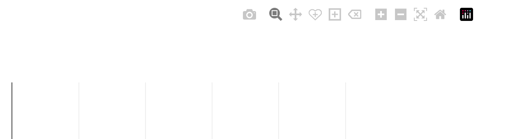
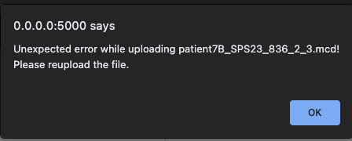

# FAQ

## Q: What are the options for downloading images from a session?

Images can be downloaded in a few ways within ccramic.

For exporting to tiff, in the left-side `Inputs/Downloads` tab under `Downloads`,
there is a collapsible button `Show download links`. Opening this collapsible
will allow you to download the canvas as a tiff file using the second link. **Important**: The current canvas
is maintained as a tiff in the backend for export, so this version will not have the
annotations saved to it (channel legend and scalebar).

If the annotations are required, the canvas can also be exported as a PNG
file with native functionality from the dash graph. Simply hover over the
current canvas and a long pop-up menu will show up in the top right, similar to what is
shown below:

    

Selecting the leftmost camera icon `Download plot as a png` will export the canvas
in this format. It is important to note however that the canvas is stored
natively as an encoded base64 object, so there can be distortions or
changes to the resolution of the image due to the conversion. This applies
largely to the ratio in size and location of the annotations relative to the
graph borders, which may not appear exactly as they appear in the
canvas due to canvas sizing.

If the canvas is required directly as is in PNG format, the best option is to expand the
canvas size to the appropriate dimensions and take a screenshot. This
will maintain the ratio of the annotations to the canvas borders.

## Q: When I expand the download button and click the links, nothing happens.

Certain browsers may block unauthorized downloads from unprotected
sites such as local https addresses by default, or from certain ports.
To bypass these restrictions, right-click on the link and select `Copy link address`.
Open up a new tab and paste the file path address and click Enter. This should allow
the download to proceed as expected.

The user may also choose to modify the security settings for the browser to accommodate either the local address or port (5000) being used,
but this is heavily dependent on the individual browser configurations for each computer.

## Q: The proportions of my image look strange, and/or the annotations (legend, scalebar) are not visible.

ccramic attempts to find the aspect ratio for each ROI and fit the canvas area viewport appropriately to
optimize these dimensions. Currently ccramic uses 75% of the screen width for hte canvas, and the other 25%
for the sidebar. Occasionally, ROIs with more extreme aspect ratios (i.e. ones that deviate noticeably from 1) will
produce strange visualizations (i.e. cropping at the sides, spilling over into the sidebar, etc.)

The user may choose to select the `Auto-fit` canvas button in order to try to repeat the auto-fitting procedure. Alternatively,
if the image appears too small or large compared to the window view, the user can use the `Canvas size` slider to make the image
appear smaller or larger in the provided area. Lastly, the size of the scalebar an legend can be changed under
`Advanced canvas options -> Configuration -> Adjust legend/scale size`

## Q: I am receiving an unexpected error on the upload use drag and drop asking to reupload the file.

If the error received looks something similar to this:

    

Then the error is occurring within the dash upload drag and drop component on file copying. It is likely that there is not sufficient disk space for the component to copy the file to the tmp directory. In this instance, to user is required to free up disk space, as the component requires adequate disk space to make a local copy of the file before analysis.
